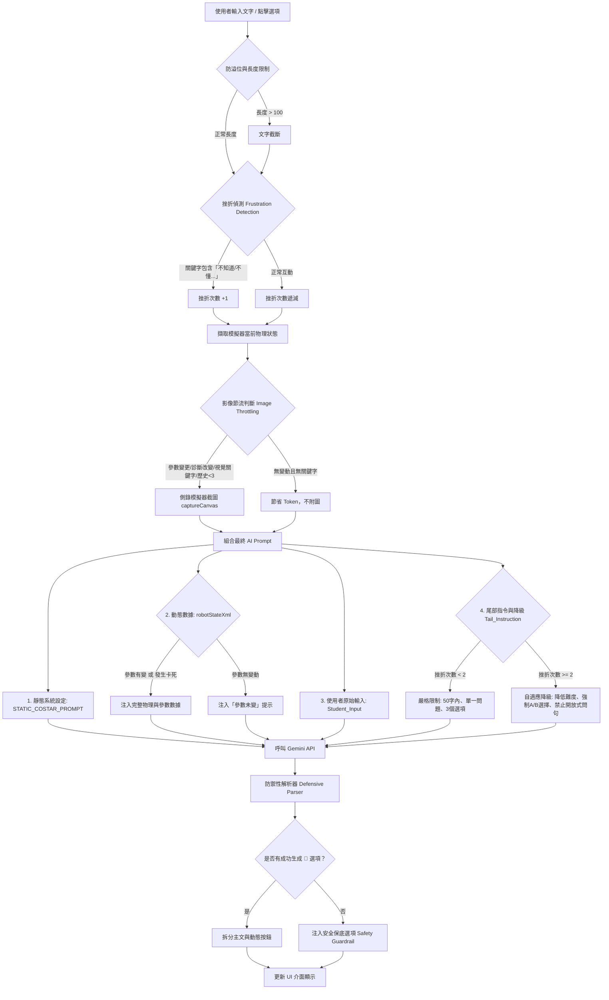
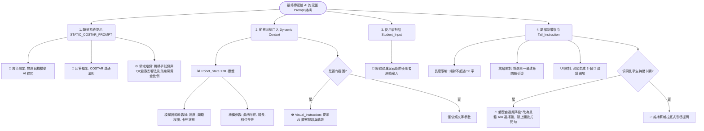

# AI 診斷對話系統架構解析

這套 AI 聊天系統的架構設計得非常有巧思，它不是單純地把使用者的文字丟給 AI，而是實作了一個完整的 **「狀態感知與自適應限制循環 (Context-Aware & Adaptive Guardrail Loop)」**。

以下是整個系統的程式碼結構審查與流程圖，說明系統如何精確地導引並限制 AI 的輸出。

## AI 診斷對話系統流程圖 (基於 `chat.js`)



---

## 系統結構深度審查與解析

從 `chat.js` 與系統提示檔可以看出，系統是透過 **「前端預處理」**、**「上下文動態組裝」** 與 **「後端防禦性解析」** 三個階段來把控 AI 的行為：

### 1. 輸入驅動與過濾 (Input Driven)
*   **防溢位 (Input Sanitization)**: 限制輸入長度在 100 字內，防止越獄 (Jailbreak) 或無意義長文消耗 Token (L156)。
*   **挫折偵測 (Frustration Detection)**: 透過攔截 `["不知道", "不懂", "壞了", "不動", ...]` 等關鍵字，或是輸入長度過短，來量化學生的學習狀態 (L161)。這直接驅動了後續的 AI 態度轉變。

### 2. 上下文引導 (Context Leading)
系統並不依賴 AI 自己去「猜」機器人長怎樣，而是強勢注入環境變數：
*   **影像節流 (Image Throttling)**: (L221) 避免每次對話都生圖，只有在「參數變動」、「診斷改變」或提到「看、圖」等關鍵字時才截圖。這確保了 AI 總是能在關鍵時刻看到影像，同時保持 API 響應速度。
*   **動態 XML 數據標籤 (`<Robot_State>`)**: (L245) 將 `getSimplifiedAnalytics()` 取得的物理數據（卡死狀態、速度、顛簸程度、各項機構參數）用 XML 格式強硬地餵給 AI，讓 AI 基於**絕對的事實數據**進行判斷，而非產生幻覺。

### 3. 輸出限制與防護 (Output Limiting & Guardrails)
這是整個架構中最關鍵的一環，用來確保 AI 的回應符合教學系統的 UI 需求：
*   **尾部指令 (Tail_Instruction)**: (L255) 這是 Prompt Engineering 的高階技巧。把最強制的限制（「限 50 字內」、「單一最致命問題」、「恰好 3 個 💬 選項」）放在整個 Prompt 的**最尾端**，能最大程度抵抗 AI 的遺忘或注意力偏移。
*   **自適應降級 (Adaptive Scaffolding)**: (L258) 如果 `frustrationCount >= 2`，系統會在尾部指令中動態追加 `【自適應降級觸發】` 的系統層級警告，強制 AI **「改用 A/B 選擇題，禁止開放式問句」**。這完美解決了 AI 在學生卡關時還一直反問「你覺得呢？」的常見痛點。
*   **防禦性解析器 (Defensive Parser)**: (L295) 就算 AI 沒有乖乖遵守規則，前端解析時會逐行檢查是否有 `💬` 符號。如果解析失敗導致陣列為空，系統會立即注入 `Safety Guardrail UX` (L311) 的保底選項（例如：「我不太懂」、「我們來試試別的」），確保 UI 工作流程絕對不會卡死。

---

## AI Prompt (系統提示詞) 結構組成拆解

在每次送出請求給 Gemini API 前，系統會將靜態規則、動態變數與強制命令組裝成一個巨大的 Payload。這個流程圖解釋了最終送出的 Prompt 裡面到底包含了哪些元件，以及它們是如何限制 AI 的。



### Prompt 區塊解析

1. **靜態系統提示 (Static Prefix)**: 這是 AI 的「靈魂與基礎知識」，包含了從 `Kinematics_Reference.md` 定義的 7 項機構學變數影響法則與幾何穩定性黃金比例，確保 AI 在回答物理問題時不會產生幻覺，而是依據專業理論與黃金比例公式進行內部診斷。
2. **動態狀態注入 (Dynamic Context)**: 這是 AI 的「眼睛與感官」。透過 `XML` 標籤把當下的物理數值（座標、速度、卡死狀態）強硬地塞進 Prompt 中。這使得 AI 不是在泛泛而談，而是能夠針對「現在」機器人的數值給出精確建議。
3. **使用者對話 (Student_Input)**: 經過防溢位處理的學生輸入。
4. **尾部防護指令 (Tail_Instruction)**: **這是控制 AI 格式的最重要防線**。LLM（大型語言模型）有「近因效應 (Recency Bias)」，把它必須遵守的死命令（50字以內、3個選項）放在 Prompt 的**最尾端**，能大幅度降低 AI 忘記格式的機率。同時，這裡也會根據學生的挫折度動態改變引導的難度（自適應降級）。

---

## 確切的 Prompt 檔案位置與輸入細節清單 (Exact & Detail List of Inputs)

Prompt 的組裝主要發生在 `c:\Users\LS404\Desktop\QTN\六足機械\modularized\chat.js` 裡面的 `getAIResponse(userText)` 函數中（約第 209 行至 290 行）。當呼叫 Gemini API (`callGeminiAPI`) 時，最終送入的 Payload 包含 4 個主要部分：`systemPrompt`、`finalUserText`、`history`、`imageData`。

### A. `systemPrompt` (系統級設定)
*   **檔案位置**: `c:\Users\LS404\Desktop\QTN\AI_Chatbot_Framework_COSTAR_EN.md` (於 `chat.js` L5 引入)。
*   **目的**: 定義 AI 的人格（機構學顧問）與回答框架（COSTAR 規則）。
*   *(註: 物理與機構診斷的細節原則參考自 `c:\Users\LS404\Desktop\QTN\六足機械\modularized\Kinematics_Reference.md`)*

### B. `finalUserText` (動態使用者文字)
這一段在 `chat.js` L263 組裝，結合了以下元素：

1.  **`<Robot_State>` (模擬器即時參數)**
    如果參數有變或卡死，會注入這段完整的資料 (L244-L249)：
    ```xml
    <Robot_State>
      <Analytics_Data>卡死=false, 穩定=true, 實際速度=25.4 mm/s, 顛簸程度=12.5 mm, 目前電量=100%, 該電量預期速度=120 mm/s</Analytics_Data>
      <Mechanical_Params>腳長=100, 機器人高度=80, 藍色直桿=50, 身體半寬=48, 曲柄孔位=20, 相位差=180°, 齒輪箱位移=0</Mechanical_Params>
      <Performance_Baseline>馬達轉速=6.0 rad/s, 理論空載速度(Expected Normal Speed)=120 mm/s</Performance_Baseline>
      <Posture_Criteria>判斷姿勢：請比較「實際速度」與「該電量預期速度」。若實際速度低於預期速度，代表步態可能打滑或不佳；若相近或超越，則代表步態優良且高效率。</Posture_Criteria>
      <Visual_Instruction>請觀察附件中的連續攝影 (Chronophotograph) ，依據腳印的分布與機身的高低起伏來輔助你的診斷。</Visual_Instruction>
    </Robot_State>
    ```
    如果參數都沒變，則只送這段節省 Token (L252)：
    ```xml
    <Robot_State>
      <Info>機械參數維持不變，持續觀察中</Info>
    </Robot_State>
    ```

2.  **`<Student_Input>` (學生的對話)**
    這包含了經過長度限制 (最大 100 字) 與防溢位處理的文字 (L263)：
    ```xml
    <Student_Input>
    [學生輸入的文字，例如："我不懂為什麼會卡住"]
    </Student_Input>
    ```

3.  **`<Tail_Instruction>` (尾部防護指令)**
    預設強制內容 (L255)：
    ```xml
    <Tail_Instruction>
    系統強制提醒：請務必遵守 COSTAR 框架，並根據 Kinematics_Reference.md 的原則進行引導提問！主文限 50 字內，針對「單一」最致命問題給予適當的引導或回饋。回覆最後必須提供恰好 3 個「💬 建議回覆選項按鈕」。
    </Tail_Instruction>
    ```
    如果 `frustrationCount >= 2` (學生連續說不知道)，會動態附加這段字 (L258)：
    ```text
    【自適應降級觸發】學生連續表示不知道或卡關。請立刻降低提問難度！改用具體的「A/B選擇題」或是「明確的參數調整指示」，禁止再使用開放式問句。
    ```

### C. `historyToSend` (對話歷史紀錄)
*   **實際內容**: `this.history.slice(0, -1)` (L266)。
*   **細節**: 只保留最近 6 句 (約 3 輪對話)，格式為 Gemini 原生的物件陣列：`[{ role: 'user', parts: [{ text: '...' }] }, { role: 'model', parts: [{ text: '...' }] }]`。

### D. `imageData` (連續攝影視覺資訊)
*   **實際內容**: `captureCanvas(currentParamsJson)` 產生的 WebP base64 影像字串。
*   **觸發條件 (L221-L225)**: 只有當 (1) 參數改變 (2) 診斷結果改變 (3) 使用者輸入包含 "看", "圖", "連續攝影", "照片", "截圖", "軌跡", "步態" (4) 對話剛開始 < 3 句時，才會帶入此截圖。否則傳遞 `null`。

---

## 實際組裝範例 (Trial Prompt Structure)

為了更具體地理解，以下是當學生調整了參數且發生卡死，並且表達不知道該怎麼辦時，系統在底層實際組裝出並傳遞給 Gemini API 的完整 Text Prompt 結構範例（不含圖片 Base64）：

```text
[A. 系統級設定 System Prompt]
你是專注於機構學與物理引擎的 AI 顧問。
(此處省略 AI_Chatbot_Framework_COSTAR_EN.md 數百字的人格設定與 COSTAR 規則...)
(此處省略 Kinematics_Reference.md 中定義的 7 大變數影響與幾何穩定性判斷...)

[C. 歷史對話 History]
User: 機器人走得好慢喔。
Model: 觀察看看腳印，是不是有些腳沒有踩在地上呢？你可以調整看看腿長或是黃色連桿。
User: 我把腿長調長了，結果現在完全不會動了。
Model: 腿太長確實會造成機構互相干涉。你還記得「幾何穩定性」中提到的比例嗎？要不要試試看調整藍色連桿來搭配現在的腿長？

[B1. 動態模擬器數據 <Robot_State>]
<Robot_State>
  <Analytics_Data>卡死=true, 穩定=false, 實際速度=0 mm/s, 顛簸程度=5.0 mm, 目前電量=100%, 該電量預期速度=120 mm/s</Analytics_Data>
  <Mechanical_Params>腳長=150, 機器人高度=80, 藍色直桿=50, 身體半寬=48, 曲柄孔位=20, 相位差=180°, 齒輪箱位移=0</Mechanical_Params>
  <Performance_Baseline>馬達轉速=6.0 rad/s, 理論空載速度(Expected Normal Speed)=120 mm/s</Performance_Baseline>
  <Posture_Criteria>判斷姿勢：請比較「實際速度」與「該電量預期速度」。若實際速度低於預期速度，代表步態可能打滑或不佳；若相近或超越，則代表步態優良且高效率。</Posture_Criteria>
  <Visual_Instruction>請觀察附件中的連續攝影 (Chronophotograph) ，依據腳印的分布與機身的高低起伏來輔助你的診斷。</Visual_Instruction>
</Robot_State>

[B2. 使用者當前輸入 <Student_Input>]
<Student_Input>
我不知道啦，它就是卡住了不動，好難喔
</Student_Input>

[B3. 尾部防護指令與降級 <Tail_Instruction>]
<Tail_Instruction>
系統強制提醒：請務必遵守 COSTAR 框架，並根據 Kinematics_Reference.md 的原則進行引導提問！主文限 50 字內，針對「單一」最致命問題給予適當的引導或回饋。回覆最後必須提供恰好 3 個「💬 建議回覆選項按鈕」。
【自適應降級觸發】學生連續表示不知道或卡關。請立刻降低提問難度！改用具體的「A/B選擇題」或是「明確的參數調整指示」，禁止再使用開放式問句。
</Tail_Instruction>
```

### 範例結構解析：
1. **System Prompt 打底**：建立嚴謹的機構學基礎與對話框架。
2. **History 提供脈絡**：讓 AI 知道剛才發生了什麼（學生調長了腿長）。
3. **Robot_State 注入鐵證**：AI 看到 `卡死=true` 與 `腳長=150`（明顯過長，且與 `藍色直桿=50` 不符合幾何穩定性），AI 就能確診病因。
4. **Student_Input 反映情緒**：學生明確表達出挫敗（「不知道啦」、「好難喔」）。
5. **Tail_Instruction 強制收斂**：因為偵測到挫折，尾部指令直接觸發了「自適應降級」。因此，AI 不會再反問「你覺得是哪裡卡住呢？」，而是會被強制轉換為保母模式：「腿長 150 太長導致卡死了。我們有兩個解法：A. 把腿長調回原本的長度，或是 B. 把藍色直桿也加長。你想試試哪一個？」
