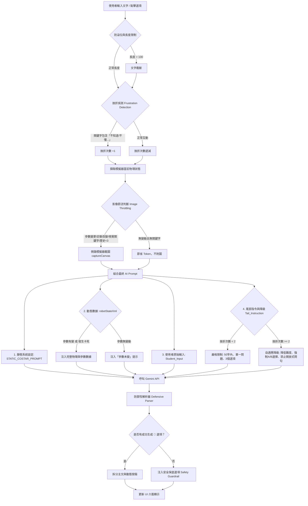

# AI 診斷對話系統架構解析

這套 AI 聊天系統的架構設計得非常有巧思，它不是單純地把使用者的文字丟給 AI，而是實作了一個完整的 **「狀態感知與自適應限制循環 (Context-Aware & Adaptive Guardrail Loop)」**。

以下是整個系統的程式碼結構審查與流程圖，說明系統如何精確地導引並限制 AI 的輸出。

## AI 診斷對話系統流程圖 (基於 `chat.js`)

---

## 系統結構深度審查與解析

從 `chat.js` 與 `ai_prompt.js` 可以看出，系統是透過 **「前端預處理」**、**「上下文動態組裝」** 與 **「後端防禦性解析」** 三個階段來把控 AI 的行為：

### 1. 輸入驅動與過濾 (Input Driven)
*   **防溢位 (Input Sanitization)**: 限制輸入長度在 100 字內，防止越獄 (Jailbreak) 或無意義長文消耗 Token (L156)。
*   **挫折偵測 (Frustration Detection)**: 透過攔截 `["不知道", "不懂", "壞了", "不動", ...]` 等關鍵字，或是輸入長度過短，來量化學生的學習狀態 (L161)。這直接驅動了後續的 AI 態度轉變。

### 2. 上下文引導 (Context Leading)
系統並不依賴 AI 自己去「猜」機器人長怎樣，而是強勢注入環境變數：
*   **影像節流 (Image Throttling)**: (L221) 避免每次對話都生圖，只有在「參數變動」、「診斷改變」或提到「看、圖」等關鍵字時才截圖。這確保了 AI 總是能在關鍵時刻看到影像，同時保持 API 響應速度。
*   **動態 XML 數據標籤 (`<Robot_State>`)**: (L245) 將 `getSimplifiedAnalytics()` 取得的物理數據（卡死狀態、速度、顛簸程度、各項機構參數）用 XML 格式強硬地餵給 AI，讓 AI 基於**絕對的事實數據**進行判斷，而非產生幻覺。

### 3. 輸出限制與防護 (Output Limiting & Guardrails)
這是整個架構中最關鍵的一環，用來確保 AI 的回應符合教學系統的 UI 需求：
*   **尾部指令 (Tail_Instruction)**: (L255) 這是 Prompt Engineering 的高階技巧。把最強制的限制（「限 50 字內」、「單一最致命問題」、「恰好 3 個 💬 選項」）放在整個 Prompt 的**最尾端**，能最大程度抵抗 AI 的遺忘或注意力偏移。
*   **自適應降級 (Adaptive Scaffolding)**: (L258) 如果 `frustrationCount >= 2`，系統會在尾部指令中動態追加 `【自適應降級觸發】` 的系統層級警告，強制 AI **「改用 A/B 選擇題，禁止開放式問句」**。這完美解決了 AI 在學生卡關時還一直反問「你覺得呢？」的常見痛點。
*   **防禦性解析器 (Defensive Parser)**: (L295) 就算 AI 沒有乖乖遵守規則，前端解析時會逐行檢查是否有 `💬` 符號。如果解析失敗導致陣列為空，系統會立即注入 `Safety Guardrail UX` (L311) 的保底選項（例如：「我不太懂」、「我們來試試別的」），確保 UI 工作流程絕對不會卡死。
